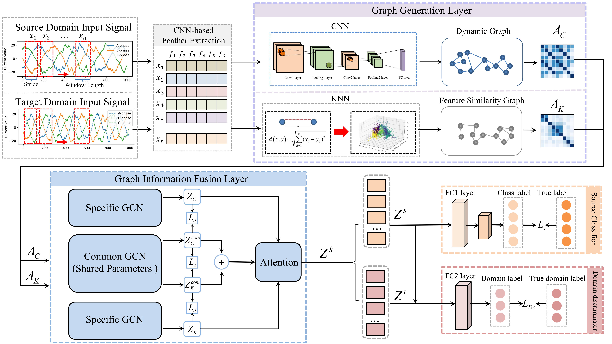
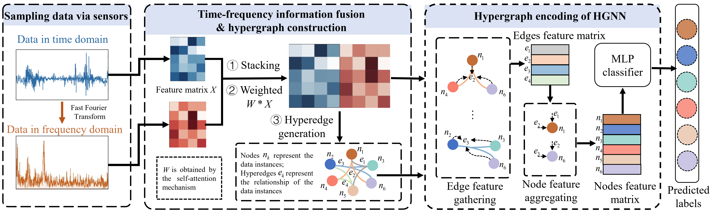

  
  

    1. Over-smoothing Relief Graph Convolutional Network-Based Fault Diagnosis Method With Application to the Rectifier of High-Speed Trains [J]
    Jiamin Xu, Haobin Ke (co-first author), etc. IEEE Transactions on Industrial Informatics, 2022
  

---

  
  

    2. Multi-Channel Domain Adaptation Graph Convolutional Networks-Based Fault Diagnosis Method and With Its Application [J]
    Zhiwen Chen, Haobin Ke (co-first author), etc. IEEE Transactions on Industrial Informatics, 2023
  

---

  
  

    3. Time-frequency Hypergraph Neural Network for Rotating Machinery Fault Diagnosis with Limited Data [C]. (Best paper award finalist)
    Haobin Ke, Zhiwen Chen, etc. The 2023 IEEE 12th Data Driven Control and Learning Systems Conference, 2023
  

---
