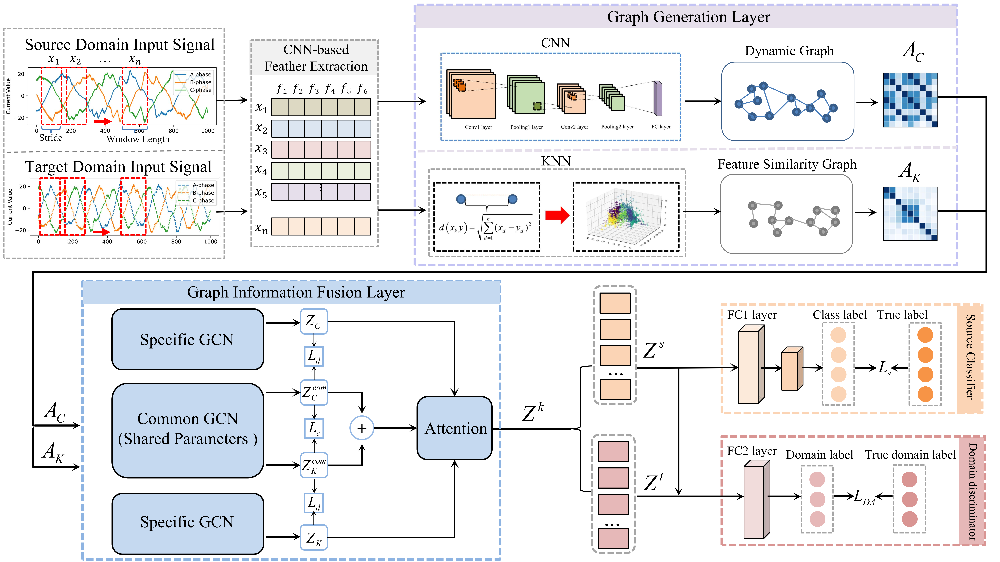
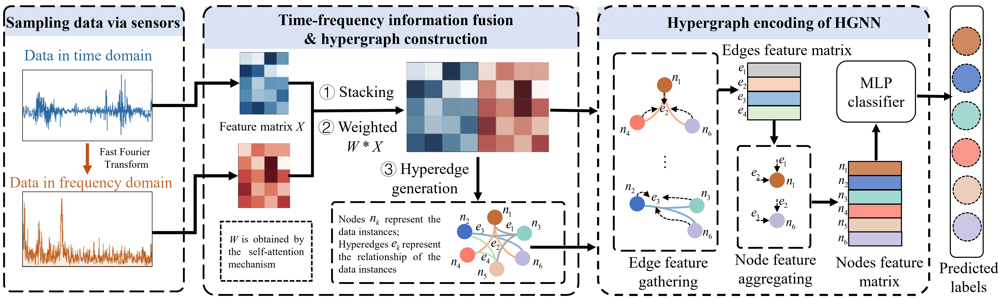
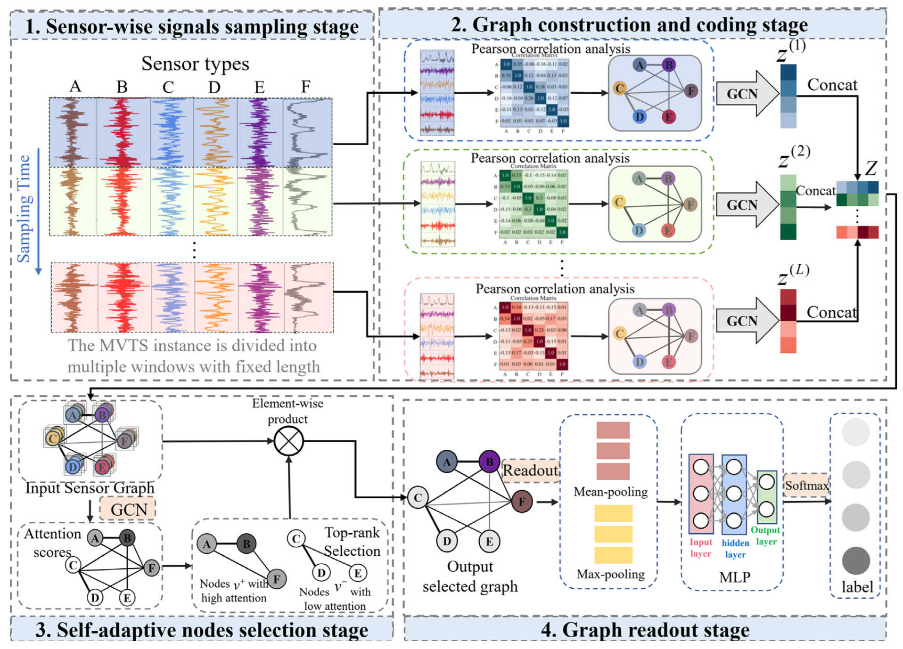
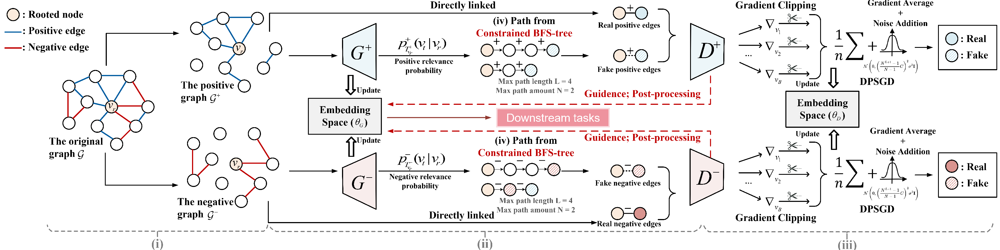

  
  

    

      1. <a href="https://ieeexplore.ieee.org/abstract/document/9757832" target="_blank">
      Over-smoothing Relief Graph Convolutional Network-Based Fault Diagnosis Method With Application to the Rectifier of High-Speed Trains
      </a>
    

    

      Jiamin Xu, <strong>Haobin Ke</strong> (co-first author), et al. 
      <em>IEEE Transactions on Industrial Informatics</em>, 2022
       (Accepted)
    

  

  
  

    

      2. <a href="https://ieeexplore.ieee.org/abstract/document/9964252" target="_blank">
      Multi-Channel Domain Adaptation Graph Convolutional Networks-Based Fault Diagnosis Method With Its Application
      </a>
    

    

      Zhiwen Chen, <strong>Haobin Ke</strong> (co-first author), et al. 
      <em>IEEE Transactions on Industrial Informatics</em>, 2023
       (Accepted)
    

  

  
  

    

      3. <a href="https://ieeexplore.ieee.org/abstract/document/10167156" target="_blank">
      Time-frequency Hypergraph Neural Network for Rotating Machinery Fault Diagnosis with Limited Data
      </a>
    

    

      <strong>Haobin Ke</strong>, Zhiwen Chen, et al. 
      <em>IEEE 12th Data Driven Control and Learning Systems Conference</em>, 2023
       (Best Paper Award Finalist)
    

  

  
  

    

      4. <a href="https://www.sciencedirect.com/science/article/pii/S0019057824004026" target="_blank">
      Self-adaptive selection graph pooling based fault diagnosis method under few samples and noisy environment
      </a>
    

    

      <strong>Haobin Ke</strong>, Zhiwen Chen, et al. 
      <em>ISA transactions</em>, 2024
       (Accepted)
    

  

  
  

    

      5. <a href="https://arxiv.org/abs/2512.00307" target="_blank"> 
      Adversarial Signed Graph Learning with Differential Privacy
    

    

      <strong>Haobin Ke</strong>, Sen Zhang, et al. 
      <em>SIGKDD Conference on Knowledge Discovery and Data Mining (KDD)</em>, 2026
       (Accepted)
    

  

